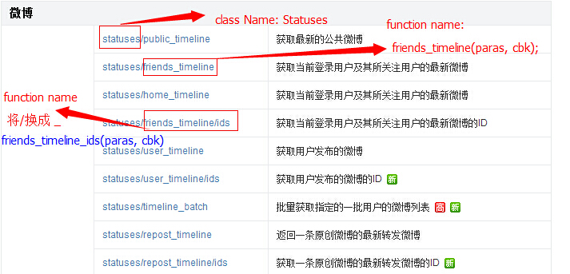

node-weibo
=========

node-weibo v2.0说明     
#####相对node-weibo v2.0之前版本的特性有：  
#######(1)更加易于后面的拓展，比如新增函数，不会影响旧版本的使用
#######(2)更加高效和管理，尊重微博API的设计原则。


####一、API使用说明
```
(1)阅读新浪微博的API文档：http://open.weibo.com/wiki/%E5%BE%AE%E5%8D%9AAPI
(2)Weibo是整个命名空间，请配置conifg->setting.json文件.
``` 
 
``` 
(3)请求授权接口作为单独的接口，即在Weibo的命名空间下Weibo.authorize();
(4)浏览：http://open.weibo.com/wiki/%E5%BE%AE%E5%8D%9AAPI     
   如上图所示，是API的命名方式.
   +---------
   比如1：需要使用“OAuth2授权接口”，点击链接到页面底部，看到“OAuth2”，那么OAuth2就是一个类，即Weibo.OAuth2.
   则Weibo.OAuth2的获取access_token的方法是：Weibo.OAuth2.access_token;
   则授权查询是：Weibo.OAuth2.get_token_info.
   类：OAuth2
   方法：access_token
   +---------
   比如2：需要使用“微博接口”,那么该类的名称是Statuses.
   则返回最新的公共微博是：public_timeline.
   整个方法的调用是Weibo.Statuses.public_timeline.
   类：Statuses
   方法：public_timeline
   +---------

   所有类和函数命名方式尊重新浪微博API方式，以此类推.
(5)所有方法两个参数，第一参数是该接口的参数(json对象格式，不含conifg->setting.json中的配置参数)
``` 
####二、example说明
```
/*
+-------------------------------------------------
(1)注册账号：http://open.weibo.com/
(2)在config->setting.json中配置您的开发账号。
(3)搞清楚微博的认证机制即oauth2.0认证原理。
(4)第3点很重要，确保你理解这种开发方式。
+-------------------------------------------------
*/

var Weibo = require('./Weibo');

/*
+-------------------------------------------------
例1：开启微博认证
启动认证后，将在浏览器器打开一个窗口，url中含有code参数
注意：运行其中一个例子时，须注释掉另一个例子。
+-------------------------------------------------
*/

Weibo.authorize();

/*
+--------------------------------------------------
例2：需要获取access_token
(1)阅读微博开放平台API
   如：http://open.weibo.com/wiki/OAuth2/access_token，
   将必要的参数写进jsonParas对象。
(2)在回调中打印出获取的数据
(3)code是您浏览器窗口获得的code。
(4)注意：如运行本例子，请注释掉第1个例子，且code职能调用一次，
		会随着认证不断更新。一个用户一个access_token。
+---------------------------------------------------
*/

var jsonParas = {
	code:"the value of your browser's parameter code",
	grant_type:"authorization_code"
};

Weibo.OAuth2.access_token(jsonParas,function(data){
	console.log(data);
});

```  

