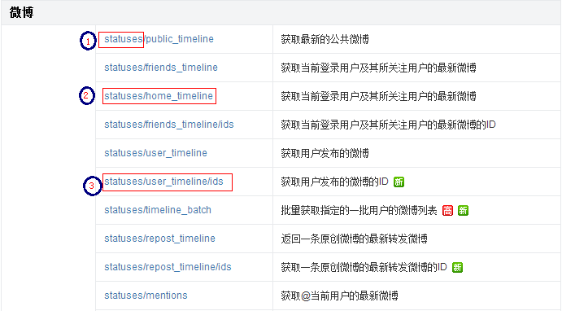
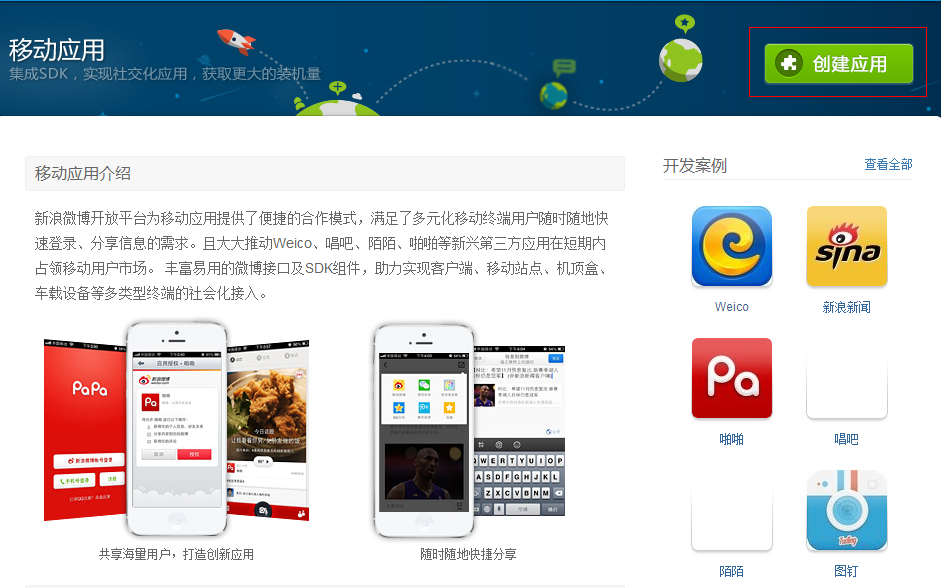
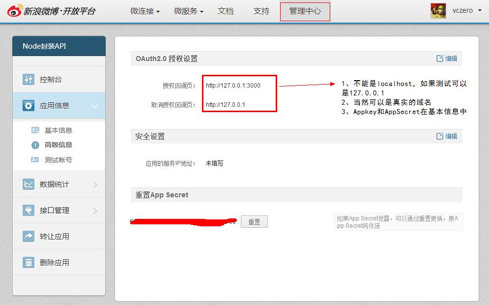

nodeweibo
=========
说明：   
1、自己工作之余写的代码，主要是为方便自己写一些小应用。未完全测试。   
2、只是对新浪微博OAuth2的简单封装。   
3、config中的key为我个人账号的key，仅供测试。如需开发应用，请重新申请。 
4、请修改config文件的中AppKey和AppSecret!同时不要修改文件的目录结构。 

####一、环境要求
1、Node.js平台   
2、request库(npm install request)   
####二、API说明
所有API都是按照新浪微博.开放平台开发的。   
     
主要规则为：
      
如上图：    
1、如标号1所示，statuses为命名空间；在statuses命名空间下全部为微博的相关接口。    
2、比如，想调用statuses/home_timeline,可以引入命名空间，statuses.home_timeline。       
3、如果如标号3所示，则为statuses.user_timeline_ids(将“/”改为“_”即可)。   
三、example     
```
var http=require('http');   
var url=require('url');   
var oauth2=require('../lib/oauth2');//引入oauth2对象   

oauth2.authorize();//启动认证   
http.createServer(function(request,response){   
    response.writeHead(200, {'Content-Type': 'text/plain'});   
    var myurl=url.parse(request.url,true);   
    var options_access_token={   
        "code":myurl.query.code,   
        "client_id":"4263807830",    
        "client_secret":"f314a703b2586510ae62a8baaef1570e",   
        "grant_type":"authorization_code",    
        "redirect_uri":"127.0.0.1:3000"   
    };   
	//获取获取授权(access_token)   
    oauth2.access_token(options_access_token,function(data){   
        console.log(data);   
    });   
    options_get_token_info={   
        "access_token":"2.00AyNwADCMVYeE55a5c9ad56Ga9tFE"   
    };   
	//授权查询   
    oauth2.get_token_info(options_get_token_info,function(data){   
        console.log(data);   
    });   
    response.end('Hello World\n');   
}).listen('3000','localhost');   
```  
####四、新浪微博APP开发须知      
1、注册个人的新浪微博账号  
2、登录新浪微博、开放平台：http://open.weibo.com/   
3、申请AppKey步骤       
####(1)登录平台，选择其中一种应用方式   
          
####(2)创建应用，按要求填写相关信息   
     
####(3)管理应用和查看基本信息        
     


